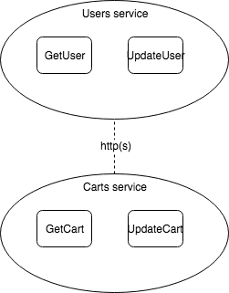

# Build first serverless application on aws using Dynamodb, Lambda, Apigateway

## Overview

Try to build a simple example to demo as the following sturcture.


### What is serverless and why serverless application?

### Why AWS?

[Offical document](https://aws.amazon.com/?icmpid=docs_menu_internal) is highly recommended.

### Fundamental services for building serverless appilication in AWS

* IAM
	IAM provides a way to securely manage and use AWS resources.
	[Read more](https://docs.aws.amazon.com/IAM/latest/UserGuide/introduction.html?icmpid=docs_iam_console)
* Dynamodb
* Lambda
	Serverless computing
* API Gateway
* S3
	In a nutshell, a file storage system, but a bit more than that.
* CloudWatch and CloudTrail

## Develop a first application on AWS

* Dynamodb
	Create 2 tables

| Tables        | Primary Key   |
| ------------- |:-------------:|
| Users         | mobile        |
| Carts         | mobile        |

* Lambda
	Create 2 lambda function getUser and getCarts
	**Note**
	* Choose creating new role for example, lambdaGetUserExecutionRole and lambdaGetCartsExecutionRole respectively
	* You will get ´´´AccessDeniedException´´´ by default without add policy to roles
	* Add policy in src folder to AWS IAM and try again

* IAM

* API Gateway
	Create 2 apis users-api and carts-api
	**Note**
	* Create 2 apis in APIGateway console.
	`
	GET /users/
	GET /carts/
	```
	Please note the option **Edge optimized**
	* Add Lambda integration, please notice the option **Lambda Proxy Integration**
	* Let's pause and go through APIGateway lifecycle
	* Save, please note the prompt notice about permission added. You can compare the lambda permission before and after to see the difference.
	* Run, no data? => Lambda Proxy
	* Deploy and test
