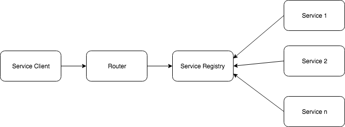

# AWS serverless application development tools

# Challenges we are facing

* Due to distributed deployment, testing can become complicated and tedious (Contract testing)
* Increasing number of services can result in information barriers (Service discovery)
* The architecture brings additional complexity as the developers have to mitigate fault tolerance, network latency, monitoring, and deal with a variety of message formats as well as load balancing
* Being a distributed system, it can result in duplication of effort
* Developers have to put additional effort into implementing the mechanism of communication between the services (Service client)
* Handling use cases that span more than one service without using distributed transactions is not only tough but also requires communication and cooperation between different teams
* The architecture usually results in increased memory consumption
* Partitioning the application into microservices is very much an art

# AWS can solve lots of them
AWS provides various tools/servics to help develop robust and elastic application in a microservices fashion. We can mention some of those

* CloudWatch
* CloudTrail
* CodePipeline
* Lambda Event
* SNS
* AutoScaling

## Service Discovery

